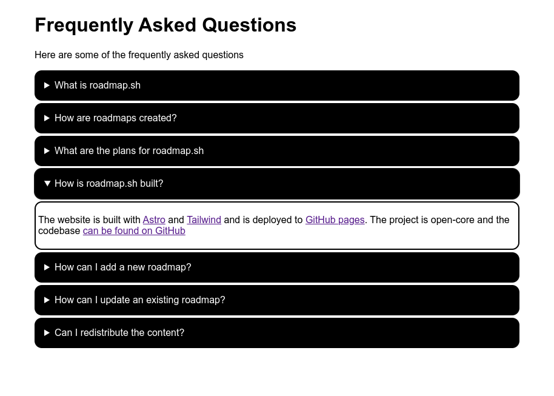
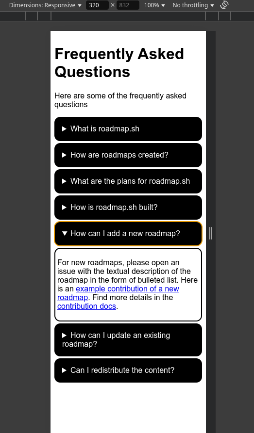

# Accordion Component
This project uses vanilla JS to have an list of accordions where only one accordion can be open at a time. Based on the requirements on [roadmap.sh: Accordion](https://roadmap.sh/projects/accordion).



## Requirements
- Create an accordion component that displays a list of questions or headings
- When the user clicks on a questions, the corresponding answer or content section will expand while collapsing any previously opened section.
- Only one section can be open at a time

## Technologies Used
- Vanilla JS
    - DOM Manipulation
    - Event Listeners
- Semantic HTML (detail and summary tags)
- Responsive CSS

## Code Decisions

### Semantic HTML
The use of `<details>` and `<summary>` elements already have the built-in functionality to open and close.

### Responsive CSS
The container of the accordion component should fill the width of smaller screens but shouldn't be too large.

```css
.container {
    max-width: 800px;
    width: 100%;
}
```



#### Accessibility
Some users may change their own font sizes for accessibility reasons. Even with a 32px font on a mobile screen, the UI still looks clean and organized.


This is due to width and height not being explicitly defined. Instead, the browser sizes these elements automatically. The only styles that affect box sizing of these elements are the margin and padding.
```css
details {
    margin: .25rem 0;
}

details>summary {
    /* ... */
    padding: 1rem;
}

details>div.accordion-body {
    /* ... */
    padding: .25rem;
    margin: .25rem 0 0;
}
```

### JavaScript
JavaScript it required to meet the requirement where only one section can be open at a time. So, this code needs to execute whenever an accordion component is opened. When this happens, these are the possible states:
- There are no open accordions
- There is one open accordion other than the one that is clicked
- There is one open accordion that is the same as the one that is clicked
- Something other than the summary is clicked

#### Solution 1: Event listener on parent container
Originally I thought to create an event listener on the container for the accordions. After guarding against the fourth case, I decided to close all accordions and let the default HTML behavior handle opening the clicked. 

It worked on my computer but I later found out it introduced a race condition. If the HTML behavior executes **before** my JavaScript, then the accordion will stay closed. 
```JavaScript
const accordionContainer = document.querySelector(".accordion-container")
const accordions = document.querySelectorAll(".accordion-container details")

accordionContainer.addEventListener("click", (event) => {
    if (event.target.tagName != "SUMMARY"){
        return
    }


    // Without this if-statement it's impossible to close an open accordion
    if (event.target.parentElement.getAttribute("open") == null){
        accordions.forEach(accordion => {
            accordion.removeAttribute("open")
        });
    }
    
})
```

#### Solution 2: Event listeners on each accordion
This solution involves creating an event listener for each of the accordion elements. After testing it, the result is a noticibly slower webpage. There's also this choppy UI experience where, for a few frames, two accordions are open before the other closes.
```JavaScript
const accordionContainer = document.querySelector(".accordion-container")
const accordions = document.querySelectorAll(".accordion-container details")


accordions.forEach(item => {
    // Creating n-number of event listeners noticably slows the webpage
    item.addEventListener("toggle", (event) => {
        if (item.open) {
            closeAllOthers(item)
        } else {
            return;
        }
    })
})

function closeAllOthers(currentElement) {
    for(const accordion of accordions){
        if (accordion === currentElement) {
            continue
        }

        accordion.removeAttribute("open")
    }
}
```

#### Solution 3: Event listener on parent container, uses function to close all but selected accordion
This is the solution I ended up with. It combines the performance of Solution 1 while removing the race condition.
```JavaScript
accordionContainer.addEventListener("click", (event) => {
    if (event.target.tagName != "SUMMARY") {
        return
    }

    closeAllOthers(event.target.parentElement)
})

function closeAllOthers(currentElement) {
    for(const accordion of accordions){
        if (accordion === currentElement) {
            continue
        }

        accordion.removeAttribute("open")
    }
}
```